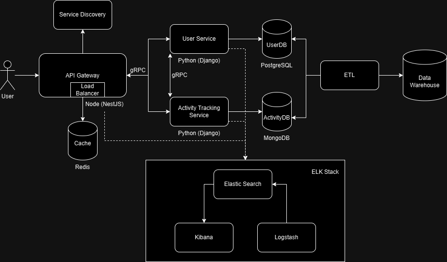

# Fitness Goal Tracker

Zlatovcen Bogdan, FAF 212

## Table of Contents

1. [Application Suitability](#application-suitability)
2. [Service Boundaries and Architecture](#service-boundaries-and-architecture)
3. [System Architecture Diagram](#system-architecture-diagram)
4. [Technology Stack](#technology-stack)
5. [Data Management](#data-management)
6. [Deployment](#deployment)
7. [How to Run](#how-to-run)


## Application Suitability

The Fitness Goal Tracker is well-suited for a microservices architecture due to the following reasons:

1. **Modular Functionality**: The application has distinct functionalities (user management, activity tracking, and managing group workout sessions) that can be developed independently.

2. **Scalability**: Different components may experience varying loads and thus require independent scaling.

3. **Technology Diversity**: Using different technologies like Python (Flask framework) and Node.js allows for choosing the best tool for each service.

4. **Future Extensibility**: It is easier to add new features and integrate external services like nutrition APIs.

Examples of similar applications:

- **Goals.Fit**: This mobile app adds ranking and leaderboards based on the fitness goals achieved.

- **Muscle Monster Workout Planner**: Shows statistics and future trends based on the fitness activity.

## Service Boundaries and Architecture

We intend to use two microservices and an API Gateway:

1. **User Service**: Manages user accounts, goals, and profiles.
2. **Activity Tracking Service**: Handles workout sessions, calorie calculations, and statistics.
3. **API Gateway**: Routes requests, manages WebSocket connections, and handles load balancing.

To ensure **Service High Availability**, each service will have multiple instances running, and the API Gateway will distribute the requests among them. This setup enhances fault tolerance and allows for scaling.

We will also implement a **Circuit Breaker** in the API Gateway that trips if multiple reroutes happen or if a service consistently fails to respond. 

## System Architecture Diagram



Key features to develop:

- **WebSockets**: Implement group sessions and develop a voting system.
- **Unit Testing**: Write unit tests using pytest for Python services and Jest for the Node.js API Gateway.
- **Circuit Breaker**: Use a circuit breaker library in the API Gateway, configured to log failures and trip if multiple reroutes or errors occur within a specified time frame.
- **Service High Availability**: Run multiple instances of each service and implement load balancing via the API Gateway.
- **Cache High Availability**: Implement cache sharding and replication in Redis to ensure high availability and scalability.
- **Database Replication and Failover**: Implement database redundancy for at least one database with a minimum of three replicas to ensure data availability and failover capabilities.
- **Data Warehouse and ETL**: Create a data warehouse that is periodically updated with all data from the databases using an ETL process.

## Technology Stack

1. **User Service**

   - **Language**: Python
   - **Framework**: Flask
   - **Database**: SQLite3 (primary), replicated with three nodes for redundancy and failover.

     We use SQLite3 as it is a relational database, suitable for structured user data. We implement database replication to ensure high availability and data redundancy.

2. **Activity Tracking Service**

   - **Language**: Python
   - **Framework**: Flask
   - **Database**: MongoDB (primary), configured with replication and sharding for scalability and high availability.

     We use MongoDB as it is a NoSQL database, ideal for storing varied workout data. Its flexible schema allows for easy addition of new types of activities/metrics. Replication and sharding are implemented for high availability and scalability.

3. **API Gateway**

   - **Language**: Node.js
   - **Load Balancing**: The API Gateway distributes incoming requests to multiple instances of each service.
   - **Circuit Breaker**: Use a circuit breaker configured to log failures and trip if multiple reroutes or errors occur within a specified time frame.

4. **Shared Cache**

   - **Technology**: Redis
   - **Features**: Cache sharding, consistent hashing, and high availability.

     Redis is used as a shared cache between services. We implement consistent hashing for cache distribution and replication for high availability. Sharding is used to scale the cache horizontally.

5. **Communication Patterns**

   - **gRPC**: For inter-service communication.
   - **WebSockets**: For real-time features like live chat, group sessions, and sending immediate alerts when a goal is achieved.
   - **RESTful APIs**: For client-server communication.

6. **Logging and Monitoring**

   - **ELK Stack**: Elasticsearch, Logstash, and Kibana are used for centralized logging, monitoring, and visualization.

     - **Elasticsearch**: Stores logs and provides search capabilities.
     - **Logstash**: Collects, processes, and forwards logs to Elasticsearch. We will use a simple input-filter-output. 
     - **Kibana**: Visualizes the logs and metrics from Elasticsearch.


7. **Data Warehouse and ETL**

   - **ETL Process**: Extracts data from the services' databases, transforms it as needed, and loads it into a centralized data warehouse for analytics.
   - **Data Warehouse**: Used to store historical data for reporting and analytics purposes.

     We might use a scheduled job or a separate service to perform ETL operations. For example, a Python script that runs daily to extract data from MongoDB and SQLite3, transform it, and load it into a PostgreSQL data warehouse.

    - Example ETL Process:
      - Extract: Pull user and activity data from MongoDB and SQLite3.
      - Transform: Clean and aggregate data, such as calculating total calories burned per user.
      - Load: Insert the transformed data into the data warehouse

8. Long-Running Saga Transactions with Coordinator

    In a microservices setup, handling transactions across multiple services can be challenging. Instead of using a traditional 2-Phase Commit, which is complex and can block other operations, we use a **Saga pattern** with a **coordinator**.

    - The coordinator oversees and sequences operations across different services, ensuring that each part of a transaction completes successfully or is rolled back if an error occurs.
    - If an operation fails, the coordinator triggers "compensating actions" (undo actions) for previously completed steps, maintaining consistency across services.

    **A possible example **:
    1. **User Sets a Goal**: The User Service updates the user profile with the new fitness goal.
    2. **Activity Tracking**: The Activity Service is notified of this new goal to adjust activity suggestions.
    3. **Error Handling**: If either of these steps fails, the coordinator ensures previous steps are undone or adjusted as needed.

9. **Containerization**

   - **Docker**: For containerizing all services and components.
   - **Docker Compose**: For local development and testing, orchestrating multiple containers.

## Data Management

### User Service Endpoints

#### HTTP Endpoints

1. **Register User**

   - **Endpoint**: `POST /users/register`
   - **Payload**:
     ```json
     {
       "username": "string",
       "email": "string",
       "password": "string"
     }
     ```
   - **Response**:
     ```json
     {
       "user_id": "string",
       "username": "string",
       "email": "string"
     }
     ```

2. **User Login**

   - **Endpoint**: `POST /users/login`
   - **Payload**:
     ```json
     {
       "email": "string",
       "password": "string"
     }
     ```
   - **Response**:
     ```json
     {
       "token": "string",
       "user_id": "string"
     }
     ```

3. **Set Goal**

   - **Endpoint**: `POST /users/{user_id}/goals`
   - **Payload**:
     ```json
     {
       "goal_type": "string",
       "target_value": "number",
       "target_date": "string"
     }
     ```
   - **Response**:
     ```json
     {
       "goal_id": "string",
       "goal_type": "string",
       "target_value": "number",
       "target_date": "string",
       "current_progress": "number"
     }
     ```

#### gRPC Endpoints

- **RegisterUser**
  - **Service**: UserService
  - **Method**: RegisterUser(UserRequest) returns (UserResponse)
- **GetUserGoal**
  - **Service**: UserService
  - **Method**: GetUserGoal(GoalRequest) returns (GoalResponse)

### Activity Tracking Service Endpoints

#### HTTP Endpoints

1. **Start Workout Session**

   - **Endpoint**: `POST /workouts/start`
   - **Payload**:
     ```json
     {
       "user_id": "string",
       "workout_type": "string"
     }
     ```
   - **Response**:
     ```json
     {
       "session_id": "string",
       "start_time": "string"
     }
     ```

2. **End Workout Session**

   - **Endpoint**: `POST /workouts/{session_id}/end`
   - **Payload**:
     ```json
     {
       "end_time": "string"
     }
     ```
   - **Response**:
     ```json
     {
       "session_id": "string",
       "duration": "number",
       "calories_burned": "number"
     }
     ```

3. **Get User Statistics**

   - **Endpoint**: `GET /users/{user_id}/statistics`
   - **Response**:
     ```json
     {
       "total_workouts": "number",
       "total_duration": "number",
       "total_calories_burned": "number",
       "average_session_duration": "number"
     }
     ```

#### gRPC Endpoints

- **StartWorkoutSession**
  - **Service**: ActivityService
  - **Method**: StartWorkoutSession(WorkoutRequest) returns (WorkoutResponse)
- **EndWorkoutSession**
  - **Service**: ActivityService
  - **Method**: EndWorkoutSession(SessionRequest) returns (WorkoutResponse)

### WebSocket Events

Group sessions will use WebSockets for real-time interaction:

- **Session Creation**: A user creates a session, which is stored in Redis with a unique session ID.
- **Joining**: Other users join the session using this ID, creating WebSocket connections.
- **Real-time Updates**: All session activities (user joins, leaves, exercise updates) are broadcasted to all participants.
- **Data Persistence**: At the end of the session, data is saved to the Activity Tracking Service's MongoDB database.

#### WebSocket Endpoints and Events

1. **Join Group Session**

   - **Event**: `join_session`
   - **Payload**:
     ```json
     {
       "type": "join_session",
       "session_id": "string",
       "user_id": "string"
     }
     ```

2. **Send Chat Message**

   - **Event**: `chat_message`
   - **Payload**:
     ```json
     {
       "type": "chat_message",
       "user_id": "string",
       "message": "string"
     }
     ```

## Deplyment

- Containerization: Create separate Dockerfiles for each service. Each Dockerfile specifies the image (Python for Flask, Node.js for API Gateway) and defines the command to run the service.
- Docker Compose: Use docker-compose.yml to define and run the multiple container application.
- ELK Stack Deployment: Deploy Elasticsearch, Logstash, and Kibana containers to handle logging and monitoring.

## How to Run

1. Clone the repository

```bash
git clone https://github.com/bogdan-404/fitness-goal-tracker.git
cd fitness-goal-tracker
```

2. Build and Run the Docker Containers

```bash
docker-compose up --build
```

3. Test the Application

Use Postman to check all the requests: HTTP, grpc and websocket connection. 

4. Shut down and delete containers

```bash
docker-compose down
```